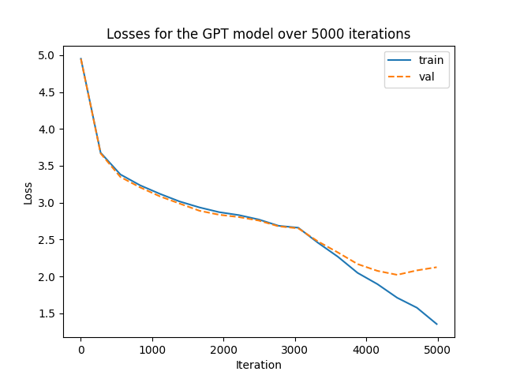

[](https://github.com/psf/black)
# gpt_from_scratch
### Repository Notice

This repository serves primarily as a sandbox environment used for experimentation and testing. While it is now publicly accessible for submission purposes, please be aware that the codebase might contain unfinished features, experimental code snippets, and other elements typically found in a developmental playground. As such, the code and its components might not represent a finalised or production-ready state. If you have questions or need further clarifications on specific parts, please feel free to reach out or raise an issue.

## Overview

This is a repository worked on as a larger part of the individual project submission MSc in Artificial Intelligence Course at Imperial College London. This is a PyTorch implementation of a smaller version of the GPT model. It has been inspired by the work of Andrej Karpathy and his nanoGPT [repo](https://github.com/karpathy/nanoGPT/tree/master) and  video [tutorial](https://github.com/karpathy/ng-video-lecture/).

It enacts the components of the transformer architecture in the pre-Norm style, which is the style used in the original paper.

The key components are:
- *Positional Encoding*: While in the original paper, the positional encoding is a sine and cosine function that is added to the input embeddings to give the model a sense of position in the sequence, I have used a learned positional encoding. This is a vector of the same dimension as the input embeddings that is added to the input embeddings. This is a vector that is learned during training.
<br><br>
- *Scaled Dot Product Attention*: This is the attention mechanism used in the Transformer. It is a dot product between the query and key vectors, scaled by the square root of the dimension of the key vectors. The output is a weighted sum of the value vectors.
<br><br>
- *Multi-Head Attention*: This is a concatenation of multiple attention heads. Each head is a scaled dot product attention mechanism. The output of each head is concatenated and then projected to the output dimension.
<br><br>
- *Feed Forward Network*: This network contains two fully connected layers with a [GeLU activation function](https://arxiv.org/abs/1606.08415) between the layers.
<br><br>
- *Pre-Norm Architecture*: In the original paper, Post-Norm architecture is used where the layer normalisation is applied after the attention mechanism. In contrast GPT applies the layer normalisation first for added stability.
## Installation
```
git clone https://github.com/Uokoroafor/gpt_from_scratch
cd gpt_from_scratch
pip install -r requirements.txt
```
## Usage
There is a sample training loop in train_gpt.py. Populate training parameters as below:
```python
import torch
from torch import nn
from gpt.models.gpt_transformer import GPT
from utils.train_utils import Trainer
from utils.file_utils import load_config

# Directly define the training hyperparameters as below or load them from a config file

#Directly defining
# training_hyperparams = {
#     'batch_size': 32,
#     'epochs': 1000,
#     'learning_rate': 5e-5,
#     'max_seq_len': 64,
#     'num_heads': 8,
#     'num_layers': 4,
#     'd_model': 128,
#     'd_ff': 128 * 4,
#     'dropout_prob': 0.2,
#     'device': torch.device('cuda' if torch.cuda.is_available() else 'cpu'),
#     'eval_every': 100,
#     'eval_iters': 10,
#     'save_every': 100,
# }

# Loading from config file
training_hyperparams = load_config("gpt_config.txt")

# Set the random seed for reproducibility
torch.manual_seed(42)  

batch_size = training_hyperparams["batch_size"]
eval_iters = training_hyperparams["eval_every"]
max_iters = training_hyperparams["epochs"]
lr = training_hyperparams["learning_rate"]

data_folder = 'data/gatsby/'


# Create the encoder and decoder dictionaries and the encode and decode functions
encoder_dict, decoder_dict, encode, decode = ...

# Establish training, validation and test data
train_data = ...
val_data = ...
test_data = ...

# Define the loss function and the model
loss_fn = nn.CrossEntropyLoss(ignore_index=encoder_dict["<pad>"])

model = GPT(
    trg_pad=encoder_dict["<pad>"], # The padding token
    trg_sos=encoder_dict["<sos>"], # The start of sequence token
    vocab_size_dec=len(encoder_dict),
    max_seq_len=training_hyperparams["max_seq_len"],
    num_heads=training_hyperparams["num_heads"],
    num_layers=training_hyperparams["num_layers"],
    d_model=training_hyperparams["d_model"],
    d_ff=training_hyperparams["d_ff"],
    dropout_prob=training_hyperparams["dropout_prob"],
    device=training_hyperparams["device"],
)

optimiser = torch.optim.Adam(
    model.parameters(), lr=lr
)  

# Create a trainer object
trainer = Trainer(
    model=model,
    loss_fn=loss_fn,
    optimiser=optimiser,
    training_hyperparameters=training_hyperparams,
)

# Train the model
model, _, _ = trainer.train(
    train_data, val_data, save_model=True, plotting=True, verbose=True
)

# Generate some text from the model

# Using top-k sampling
sampled_chars = decode(
    model.generate(
        start_token=encoder_dict["<sos>"] * torch.ones((1, 1), dtype=torch.long),
        max_length=100,
        k=6,
        temp=1.6,
    )[0].tolist()
)

# Using greedy generation
greedy_chars = decode(
    model.generate(
        start_token=encoder_dict["<sos>"] * torch.ones((1, 1), dtype=torch.long),
        max_length=100,
        sampled=False,
    )[0].tolist()
)
```
###  Results
The plot below is for a training run on a small model (CPU) trained on the gatsby dataset. Sample output is shown below the plot.


```
the say went to be like a little for the house, and
we were came into the miror. The miror hands  but she urttion her hand
she cared at the chair, and then saw me for the door.

"What do you like it?” said Mr. Wolfshiem, and I calmosed to the turned
toward the familiar of the bridg and slowly for the door.
```

## References
- [Attention Is All You Need](https://arxiv.org/abs/1706.03762)
- [Andrej Karpathy's github repo](https://github.com/karpathy)
- [Language Models are Unsupervised Multitask Learners](https://d4mucfpksywv.cloudfront.net/better-language-models/language-models.pdf)

## License
[](https://opensource.org/licenses/MIT)


